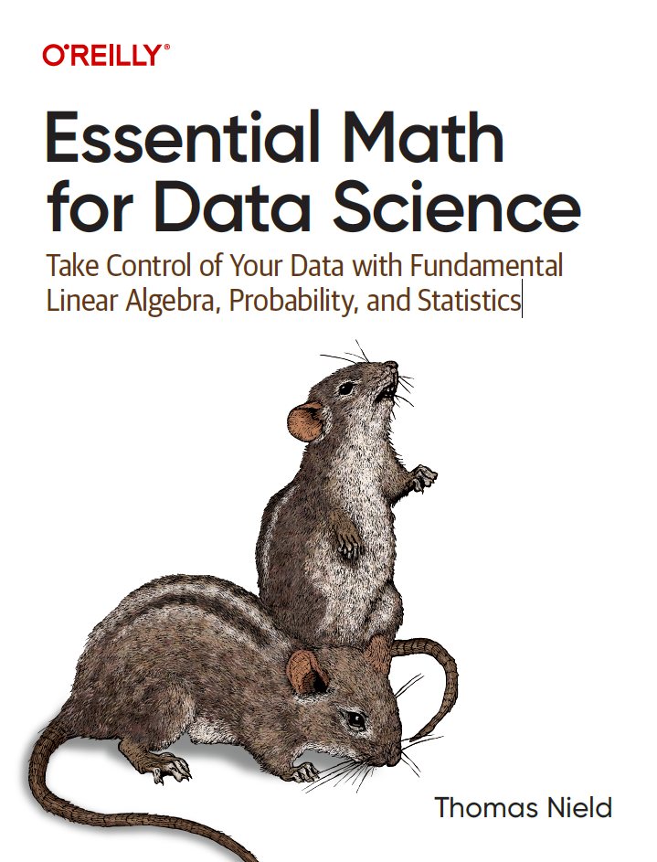
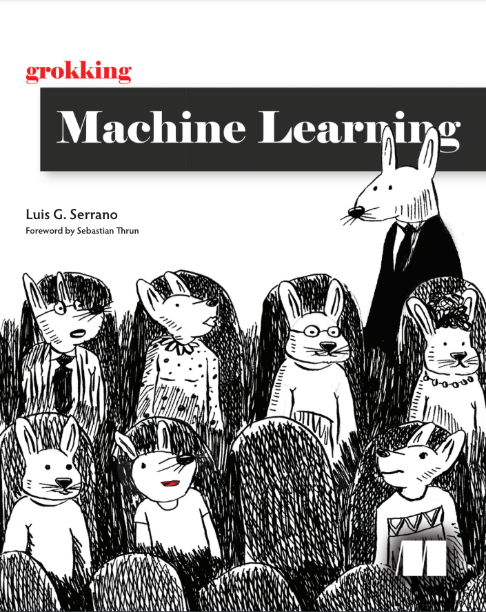
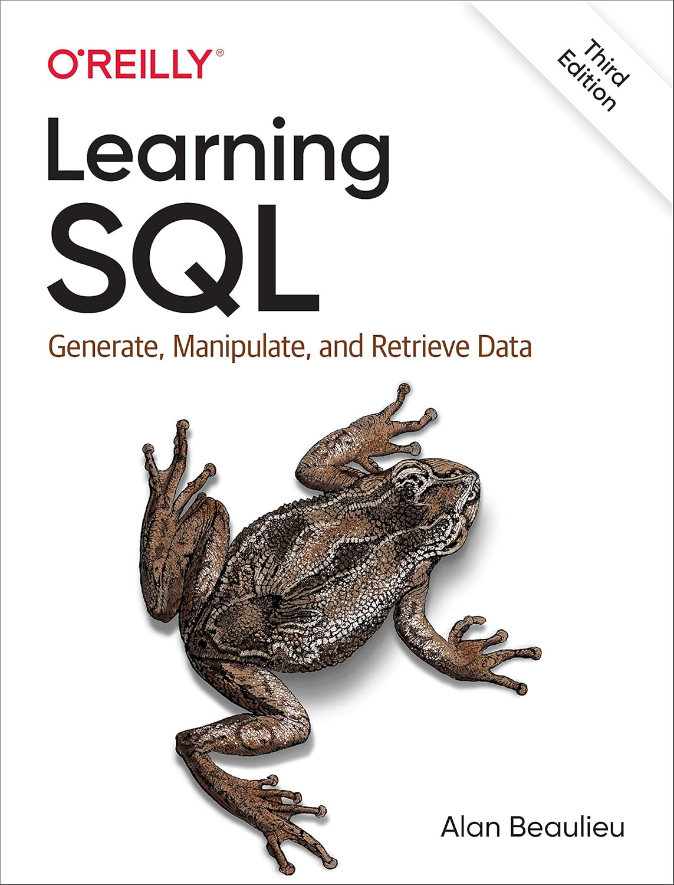
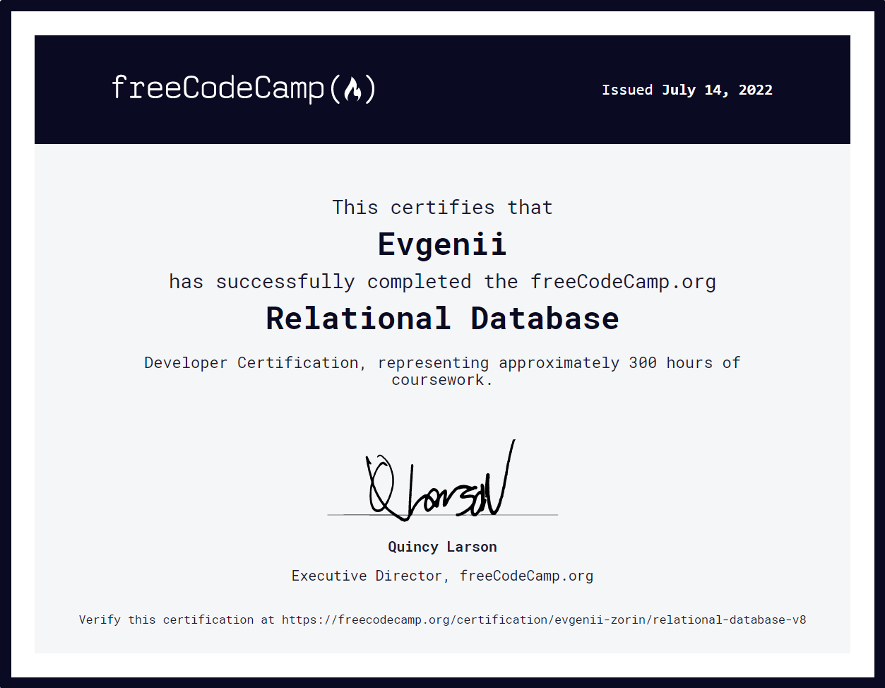
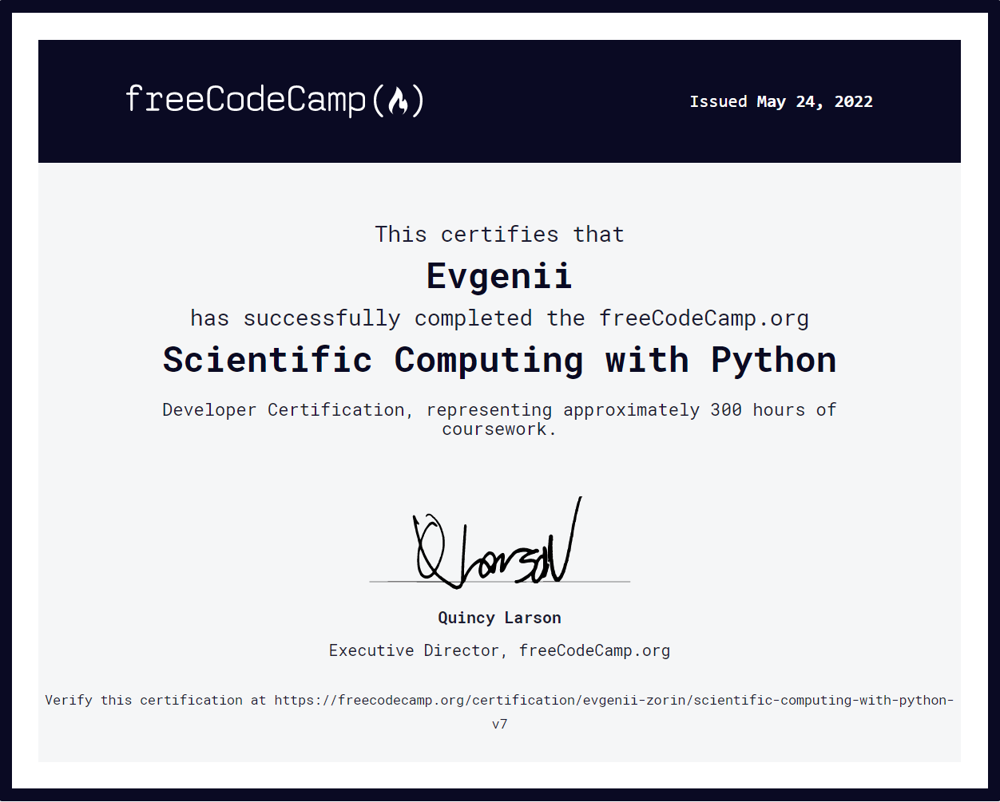

Here I would like to showcase all the resources that I have used for my **CPD (Continuous Professional Development)**. I enjoy learning new things related to my career in different ways:
- Doing online courses from websites such as Coursera, Udemy, FreeCodeCamp;
- Reading textbooks on topics in Data Science, Statistics, and Programming;
- Attending and participating in live events;
- Some websites allow me to practice SQL, Python, Bash, etc., such as [Hackerrank](https://www.hackerrank.com/profile/zorin_evgenii_m), [Leetcode](https://leetcode.com/u/vzem_19/), [Codewars](https://www.codewars.com/users/EvgeniiZorin)

> Please note that this section is still being written, so there are many things that are not present here! 

# Books

You can see a full list of Data Science and Programming - related books that I have read on my [Goodreads](https://www.goodreads.com/review/list/145948565-evgenii-zorin?shelf=_data-science). If you wish to make me a present, you can check which book I currently desire on the [dedicated shelf on Goodreads](https://www.goodreads.com/review/list/145948565-evgenii-zorin?shelf=want-to-read-science-tech).

| Resource | My thoughts |
| - | - |
| **Essential Math for Data Science** - Thomas Nield (O'Reily)    | While not as rigorous and comprehensive as other books on Data Science, this one is a relatively easy read that is perfect for revising challenging theoretical concepts in Machine Learning. |
| **Grokking Machine Learning** - Luis Serrano, Manning Publications    | This book is an excellent introduction into the world of Machine Learning - it uses very simple examples to explain different ML algorithms and Gradient Boosting. I believe that this is the best book that a person can choose to start their journey into the world of ML. |
| **Learning SQL** - Alan Beaulieu (O'Reily)    | |

# Courses and certificates

| Resource | My thoughts |
| - | - |
| **Machine Learning Specialisation** - DeepLearning.ai, Stanford (Coursera)   </td> | This is an amazing comprehensive course that teaches both theoretical and practical aspects of building ML models. I believe that this might be the best course on ML out there and would highly recommend it! |
| **freeCodeCamp** courses  - **Data Analysis with Python**     - **Relational Database**     - **Scientific Computing with Python**    | These courses are very basic, but excellent for new learners to help them master the basics of python, SQL, bash, etc.. |

